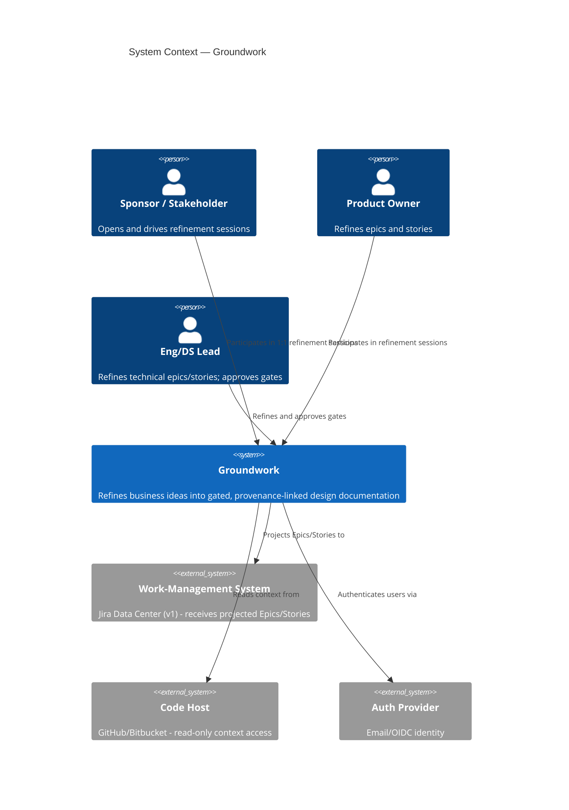
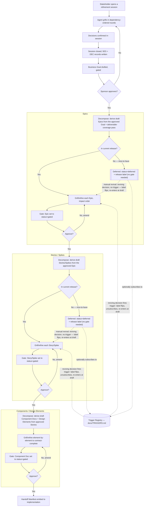

# BG-0001: Groundwork — ground implementation in refined business intent

## Problem

Business requests reach the tech side poorly defined, vague, or mutually
contradictory. Requirements arrive without the refinement needed to implement
them; competing requests work against each other undetected. The cost appears
downstream as rework, misaligned implementations, and systems that drift from
the intent that motivated them. ([SES-0001](../sessions/SES-0001-groundwork-inception.md) @ T1.)

## Current State & Gap

Nothing plays this role today. Requests arrive as informal conversations,
ad hoc documents, or directly-authored backlog tickets, with no structured
refinement step and no comparable in-house tool
([SES-0001](../sessions/SES-0001-groundwork-inception.md) @ T1). The
agent is required to be aware of existing systems and backlog as context
when refining new goals, but new goals are always greenfield — Groundwork
does not retroactively ingest or reconcile against an existing backlog
([DEC-0004](../decisions/DEC-0004-new-goals-existing-context.md)).

The specific gap: no gated pipeline connecting a line of implementation
back to the decision and conversation that justified it, and no mechanism
that surfaces contradictory or competing requests before they collide
downstream ([SES-0001](../sessions/SES-0001-groundwork-inception.md) @
T1). ([DEC-0189](../decisions/DEC-0189-current-state-and-gap-bg-section.md).)

## Intent

Build **Groundwork** (per [DEC-0025](../decisions/DEC-0025-name-groundwork.md)):
a standalone application ([DEC-0001](../decisions/DEC-0001-standalone-application.md))
in which an AI agent refines raw business ideas into implementation-ready
specifications through unsupervised 1:1 Q&A sessions
([DEC-0003](../decisions/DEC-0003-unsupervised-sessions.md)) with business
stakeholders, product owners, and engineering/data-science leads — producing
a gated hierarchy of Business Goals → Epics → Stories/Spikes →
contract-complete Component Docs, with every artifact provenance-linked to
the decisions and conversations that shaped it
([DEC-0015](../decisions/DEC-0015-transcript-decision-citation-chain.md)).

## System Context

Boundary-only — see
[DEC-0190](../decisions/DEC-0190-system-context-bg-section.md).

1. **What are we building?** A standalone web application in which an AI
   agent conducts unsupervised 1:1 refinement sessions with business
   stakeholders, product owners, and engineering/data-science leads,
   producing a gated hierarchy of Business Goals → Epics → Stories/Spikes
   → contract-complete Component Docs, stored as git-backed markdown and
   kept in sync with a work-management system
   ([DEC-0001](../decisions/DEC-0001-standalone-application.md),
   [DEC-0025](../decisions/DEC-0025-name-groundwork.md)).
2. **Who will use this, and how?** Business stakeholders, product owners,
   and engineering/data-science leads, each acting as approver at the
   gates their role owns — interacting through a web UI via unsupervised
   1:1 Q&A sessions
   ([DEC-0001](../decisions/DEC-0001-standalone-application.md),
   [DEC-0003](../decisions/DEC-0003-unsupervised-sessions.md),
   [DEC-0021](../decisions/DEC-0021-one-on-one-sessions.md)).
3. **Where will this live?** Deployed as a standalone application; v1
   runs as a single-process, single-writer embedded-engine deployment
   (per the armed triggers in `docs/TRIGGERS.md` — `TRG-0001`/`TRG-0002` —
   until a multi-node or multi-writer requirement fires them)
   ([DEC-0001](../decisions/DEC-0001-standalone-application.md)).
4. **Trigger & output.** Trigger: a stakeholder opens or resumes a
   refinement session on an idea. Output: created or updated gated
   artifacts in the Canonical Store, projected to the work-management
   system and the Graph Index
   ([DEC-0002](../decisions/DEC-0002-doc-store-canonical.md),
   [DEC-0010](../decisions/DEC-0010-graph-index-derived.md),
   [DEC-0013](../decisions/DEC-0013-jira-summary-plus-link.md)).
5. **Existing vs. new (this system's own parts).** Groundwork is
   greenfield — no pre-existing internal system performs this function;
   every engine (artifact store, session agent, governance, graph index,
   connectors, UI, consolidation memory) is built from scratch for v1.
   Which epic owns the process/composition layer that assembles these
   engines into one running application is not yet settled — the gap
   identified and worked in
   [SES-0035](../sessions/SES-0035-goal-template-redesign.md), closed by
   a forthcoming epic.
6. **Existing systems that must change.** None internally (greenfield);
   externally, none are modified — the work-management system and code
   hosts are integrated through read/write connectors, never altered
   directly.
7. **External systems it depends on.** A work-management system (Jira
   Data Center for v1, via the Work-Management Connector), a code host
   (via the Code-Host Connector), and an auth provider (email/OIDC)
   ([DEC-0024](../decisions/DEC-0024-pluggable-auth.md)).

### Context Diagram

### Process Flow

Components/Design Elements have no `deferred` state in the artifact model
— only epics, stories, and spikes carry `deferred` + a `release:` label —
so no deferred branch is drawn there.

## Illustrative Scenario

Non-binding — see
[DEC-0191](../decisions/DEC-0191-illustrative-scenario-bg-section.md).

**Happy path:** A product owner has a rough idea. They open a new
refinement session; the agent grills them in dependency-ordered rounds,
confirming decisions in plain language as they go. The agent closes the
session, records the transcript and the confirmed decisions, and drafts a
Business Goal citing them. The sponsor reviews the gated goal — including
its Context Diagram — and approves it. The agent derives draft Epics,
sequences them by impact, and the pipeline continues: Epics refine into
Stories/Spikes, Stories/Spikes refine into contract-complete Component
Docs, each layer gated by its approver before the next derives from it.

**Bad paths:** A stakeholder's answer contradicts an earlier answer or an
accepted decision; the agent surfaces the tension immediately, attempts
mediation, and — if unresolved — opens a Conflict record and escalates to
the arbiter. Refinement on the affected artifacts is blocked until the
conflict resolves
([DEC-0005](../decisions/DEC-0005-intent-first-mediation-then-escalation.md)).

## Outcomes & Success Criteria

1. **Traceability**: every implemented component traces through the artifact
   graph to at least one approved Business Goal, and every contract line
   cites the Decision behind it (per
   [DEC-0009](../decisions/DEC-0009-typed-links-stable-ids.md),
   [DEC-0011](../decisions/DEC-0011-contract-complete-component-docs.md)).
2. **Conflict surfacing**: contradictory or competing requests are detected
   during refinement and either mediated or escalated with documented intent
   — never silently shipped (per
   [DEC-0005](../decisions/DEC-0005-intent-first-mediation-then-escalation.md)).
3. **Human-ratified layers**: no artifact feeds the next stage without a
   named approver's sign-off (per
   [DEC-0006](../decisions/DEC-0006-gate-every-stage.md)).
4. **Parallel implementability**: an implementation swarm can build
   components from the Handoff Manifest with (ideally) no context beyond the
   docs and their cross-references (per
   [DEC-0011](../decisions/DEC-0011-contract-complete-component-docs.md),
   [DEC-0014](../decisions/DEC-0014-docs-are-the-product.md)).
5. **Sync without drift**: Jira reflects the canonical docs at all times;
   detected drift reconciles toward canon (per
   [DEC-0002](../decisions/DEC-0002-doc-store-canonical.md)).

## Scope

**Releases:**
- `1` (current) — the v1 vertical slice: goal refinement end-to-end (per
  [DEC-0022](../decisions/DEC-0022-v1-goal-refinement-slice.md)), plus the
  epics that carry it.
- `2` — the follow-on expansion named by
  [DEC-0022](../decisions/DEC-0022-v1-goal-refinement-slice.md)'s
  sequencing: connectors, full Graph Index, consolidations.

Declared per [DEC-0099](../decisions/DEC-0099-releases-declared-in-goal-scope.md);
labels follow [DEC-0098](../decisions/DEC-0098-semver-release-labels.md).

**In:** the refinement pipeline (sessions, synthesis, conflict handling);
the artifact model and canonical store; gates and governance; the
cross-reference graph and derived Graph Index; the consolidation memory
layer; Jira projection; read-only code-host context; the Handoff Manifest.

**Out:** orchestrating the implementation swarm
([DEC-0014](../decisions/DEC-0014-docs-are-the-product.md));
retroactive ingestion of the existing backlog
([DEC-0004](../decisions/DEC-0004-new-goals-existing-context.md));
post-implementation feedback ingestion (a candidate future goal).

## Constraints

- Reference stack: Python backend, TypeScript frontend; all specifications
  language-agnostic and sufficient to rebuild any layer in another stack
  ([DEC-0018](../decisions/DEC-0018-python-backend-language-agnostic-specs.md)).
- Pluggable, contract-defined boundaries for: Q&A UI, doc storage/retrieval,
  Jira connection, code-host connections, auth
  ([DEC-0024](../decisions/DEC-0024-pluggable-auth.md)).
- Groundwork is specified using its own formats — this repository is the
  first Canonical Store ([DEC-0019](../decisions/DEC-0019-full-dogfood.md)).
- **Compliance & data residency:** none identified. Groundwork v1 targets
  internal/organizational use; no regulatory framework (GDPR, HIPAA,
  PCI-DSS, or similar) is currently in scope. Revisit if a deployment
  extends into a context bound by one.

## Stakeholders & Roles

- **Sponsor / Arbiter (bootstrap):** awakeinagi@gmail.com — tech-side lead
  bridging business and engineering.
- **Future participants:** business thought leaders (Stakeholders), product
  owners, engineering leads, data science leads, per the role model in
  [CONTEXT.md](../../CONTEXT.md).

## Conflicts & Tensions

None identified. The known internal tension — 100% self-contained component
docs vs. quality-first pragmatism — was resolved by
[DEC-0011](../decisions/DEC-0011-contract-complete-component-docs.md)
(contract-complete standard, crawlable fallback, iterative tightening).

## Derived Work

- [EP-0001](../epics/EP-0001-artifact-store-and-format-engine.md) — Artifact Store & Format Engine
- [EP-0002](../epics/EP-0002-refinement-session-agent.md) — Refinement Session Agent
- [EP-0003](../epics/EP-0003-governance-and-gate-engine.md) — Governance & Gate Engine
- [EP-0004](../epics/EP-0004-graph-index.md) — Cross-Reference Graph Index
- [EP-0005](../epics/EP-0005-connectors-and-identity.md) — Connectors & Identity
- [EP-0006](../epics/EP-0006-refinement-web-ui.md) — Refinement Web UI
- [EP-0007](../epics/EP-0007-consolidation-memory-layer.md) — Consolidation Memory Layer
- [SP-0001](../spikes/SP-0001-impact-ranking-algorithm.md) — Ranking algorithm
  for impact-based refinement ordering (cross-cutting spike, per
  [DEC-0027](../decisions/DEC-0027-impact-ranked-refinement-order.md))
