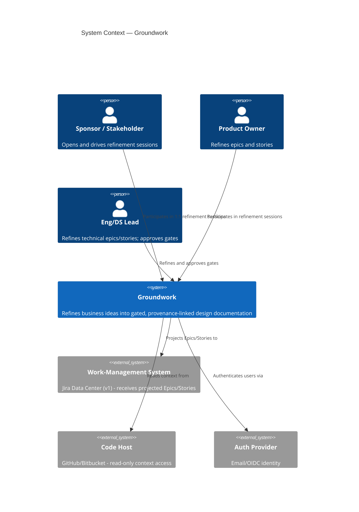
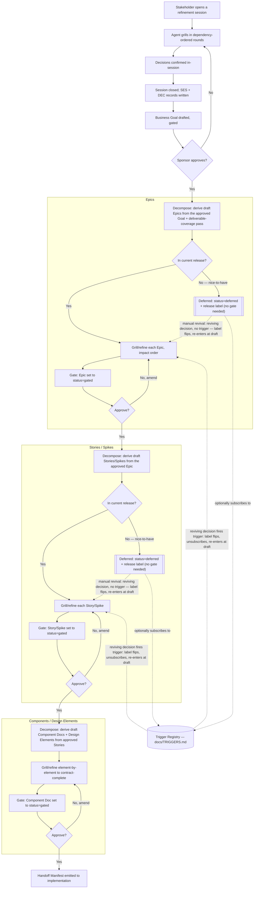

# BG-0001: Groundwork — ground implementation in refined business intent

## Problem

Business requests reach the tech side poorly defined, vague, or mutually
contradictory. Requirements arrive without the refinement needed to implement
them; competing requests work against each other undetected. The cost appears
downstream as rework, misaligned implementations, and systems that drift from
the intent that motivated them. (SES-0001 @ T1.)

## Current State & Gap

Nothing plays this role today. Requests arrive as informal conversations,
ad hoc documents, or directly-authored backlog tickets, with no structured
refinement step and no comparable in-house tool
(SES-0001 @ T1). The
agent is required to be aware of existing systems and backlog as context
when refining new goals, but new goals are always greenfield — Groundwork
does not retroactively ingest or reconcile against an existing backlog
(DEC-0004).

The specific gap: no gated pipeline connecting a line of implementation
back to the decision and conversation that justified it, and no mechanism
that surfaces contradictory or competing requests before they collide
downstream (SES-0001 @
T1). (DEC-0189.)

## Intent

Build **Groundwork** (per DEC-0025):
a standalone application (DEC-0001)
in which an AI agent refines raw business ideas into implementation-ready
specifications through unsupervised 1:1 Q&A sessions
(DEC-0003) with business
stakeholders, product owners, and engineering/data-science leads — producing
a gated hierarchy of Business Goals → Epics → Stories/Spikes →
contract-complete Component Docs, with every artifact provenance-linked to
the decisions and conversations that shaped it
(DEC-0015).

## System Context

Boundary-only — see
DEC-0190.

1. **What are we building?** A standalone web application in which an AI
   agent conducts unsupervised 1:1 refinement sessions with business
   stakeholders, product owners, and engineering/data-science leads,
   producing a gated hierarchy of Business Goals → Epics → Stories/Spikes
   → contract-complete Component Docs, stored as git-backed markdown and
   kept in sync with a work-management system
   (DEC-0001,
   DEC-0025).
2. **Who will use this, and how?** Business stakeholders, product owners,
   and engineering/data-science leads, each acting as approver at the
   gates their role owns — interacting through a web UI via unsupervised
   1:1 Q&A sessions
   (DEC-0001,
   DEC-0003,
   DEC-0021).
3. **Where will this live?** Deployed as a standalone application; v1
   runs as a single-process, single-writer embedded-engine deployment
   (per the armed triggers in `docs/TRIGGERS.md` — `TRG-0001`/`TRG-0002` —
   until a multi-node or multi-writer requirement fires them)
   (DEC-0001).
4. **Trigger & output.** Trigger: a stakeholder opens or resumes a
   refinement session on an idea. Output: created or updated gated
   artifacts in the Canonical Store, projected to the work-management
   system and the Graph Index
   (DEC-0002,
   DEC-0010,
   DEC-0013).
5. **Existing vs. new (this system's own parts).** Groundwork is
   greenfield — no pre-existing internal system performs this function;
   every engine (artifact store, session agent, governance, graph index,
   connectors, UI, consolidation memory) is built from scratch for v1.
   Which epic owns the process/composition layer that assembles these
   engines into one running application is not yet settled — the gap
   identified and worked in
   SES-0035, closed by
   a forthcoming epic.
6. **Existing systems that must change.** None internally (greenfield);
   externally, none are modified — the work-management system and code
   hosts are integrated through read/write connectors, never altered
   directly.
7. **External systems it depends on.** A work-management system (Jira
   Data Center for v1, via the Work-Management Connector), a code host
   (via the Code-Host Connector), and an auth provider (email/OIDC)
   (DEC-0024).

### Context Diagram

### Process Flow

Components/Design Elements have no `deferred` state in the artifact model
— only epics, stories, and spikes carry `deferred` + a `release:` label —
so no deferred branch is drawn there.

## Illustrative Scenario

Non-binding — see
DEC-0191.

**Happy path:** A product owner has a rough idea. They open a new
refinement session; the agent grills them in dependency-ordered rounds,
confirming decisions in plain language as they go. The agent closes the
session, records the transcript and the confirmed decisions, and drafts a
Business Goal citing them. The sponsor reviews the gated goal — including
its Context Diagram — and approves it. The agent derives draft Epics,
sequences them by impact, and the pipeline continues: Epics refine into
Stories/Spikes, Stories/Spikes refine into contract-complete Component
Docs, each layer gated by its approver before the next derives from it.

**Bad paths:** A stakeholder's answer contradicts an earlier answer or an
accepted decision; the agent surfaces the tension immediately, attempts
mediation, and — if unresolved — opens a Conflict record and escalates to
the arbiter. Refinement on the affected artifacts is blocked until the
conflict resolves
(DEC-0005).

## Outcomes & Success Criteria

1. **Traceability**: every implemented component traces through the artifact
   graph to at least one approved Business Goal, and every contract line
   cites the Decision behind it (per
   DEC-0009,
   DEC-0011).
2. **Conflict surfacing**: contradictory or competing requests are detected
   during refinement and either mediated or escalated with documented intent
   — never silently shipped (per
   DEC-0005).
3. **Human-ratified layers**: no artifact feeds the next stage without a
   named approver's sign-off (per
   DEC-0006).
4. **Parallel implementability**: the Swarm Orchestrator dispatches an
   implementation swarm from the Handoff Manifest's work packages and
   Slices, each agent starting with empty conversational context —
   its bundle, the Shared Preamble, and the pinned corpus (per
   DEC-0011,
   DEC-0304,
   DEC-0308).
5. **Sync without drift**: Jira reflects the canonical docs at all times;
   detected drift reconciles toward canon (per
   DEC-0002).

## Scope

**Releases:**
- `1` (current) — the v1 vertical slice: goal refinement end-to-end (per
  DEC-0022), plus the
  epics that carry it.
- `2` — the follow-on expansion named by
  DEC-0022's
  sequencing: connectors, full Graph Index, consolidations.

Declared per DEC-0099;
labels follow DEC-0098.

**In:** the refinement pipeline (sessions, synthesis, conflict handling);
the artifact model and canonical store; gates and governance; the
cross-reference graph and derived Graph Index; the consolidation memory
layer; Jira projection; read-only code-host context; the Handoff Manifest
(work packages and Slices, per DEC-0300 and
DEC-0302); the Swarm Orchestrator — dispatching
implementation agents from the manifest, verifying slice acceptance, and
reporting results (per DEC-0308, which supersedes
the prior exclusion; orchestration-model spike
SP-0012 precedes its epic derivation).

**Out:** retroactive ingestion of the existing backlog
(DEC-0004);
post-implementation feedback ingestion into the doc corpus (deferred by
DEC-0308, revisited on
SP-0012's findings).

## Constraints

- Reference stack: Python backend, TypeScript frontend; all specifications
  language-agnostic and sufficient to rebuild any layer in another stack
  (DEC-0018).
- Pluggable, contract-defined boundaries for: Q&A UI, doc storage/retrieval,
  Jira connection, code-host connections, auth
  (DEC-0024).
- Groundwork is specified using its own formats — this repository is the
  first Canonical Store (DEC-0019).
- **Compliance & data residency:** none identified. Groundwork v1 targets
  internal/organizational use; no regulatory framework (GDPR, HIPAA,
  PCI-DSS, or similar) is currently in scope. Revisit if a deployment
  extends into a context bound by one.

## Stakeholders & Roles

- **Sponsor / Arbiter (bootstrap):** awakeinagi@gmail.com — tech-side lead
  bridging business and engineering.
- **Future participants:** business thought leaders (Stakeholders), product
  owners, engineering leads, data science leads, per the role model in
  [CONTEXT.md](../../CONTEXT.md).

## Conflicts & Tensions

None identified. The known internal tension — 100% self-contained component
docs vs. quality-first pragmatism — was resolved by
DEC-0011
(contract-complete standard, crawlable fallback, iterative tightening).

## Derived Work

- EP-0001 — Artifact Store & Format Engine
- EP-0002 — Refinement Session Agent
- EP-0003 — Governance & Gate Engine
- EP-0004 — Cross-Reference Graph Index
- EP-0005 — Connectors & Identity
- EP-0006 — Refinement Web UI
- EP-0007 — Consolidation Memory Layer
- EP-0008 — Backend Application Platform (derived late, closing the
  structural-deliverable gap found in the SES-0035 retrospective)
- SP-0001 — Ranking algorithm
  for impact-based refinement ordering (cross-cutting spike, per
  DEC-0027)
- SP-0006 — An amends link type for partial supersession (deferred,
  backlog)
- SP-0007 — Contract-item-level graph nodes with per-item decision
  citations

Format provenance: this goal's refinement and gating follow the
SES-0035 template redesign — the tiered goal-grilling question bank
(per DEC-0192), the deliverable-coverage pass at epic derivation whose
re-run yielded EP-0008 (per DEC-0193), and the gate-time Context and
Process Flow diagrams (per DEC-0194).
